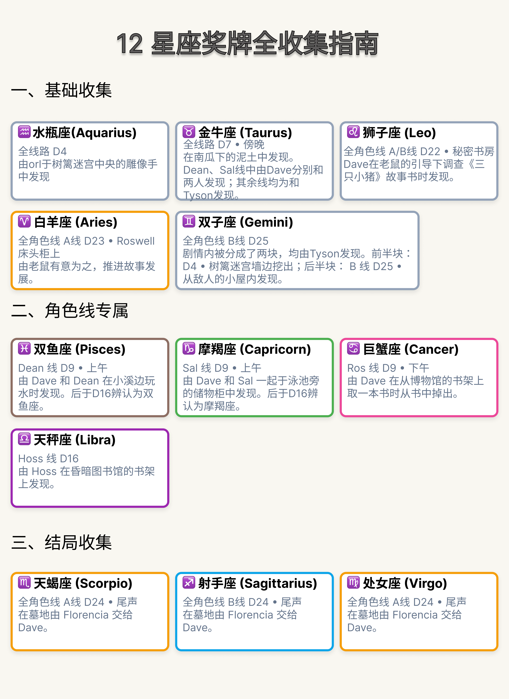

十二枚星座奖牌不仅用于补充《Password》的世界观，也是进入 Path P 真结局的必要条件。

b0.85 新增的 Compendium Lore 提供了游戏内收集提示，但部分条目记录的是 Dave 确认奖牌身份或程序写入收集状态的时间，不一定等同于奖牌首次被发现的时间。

::: {.callout-warning}
## 剧透预警

本页会展示部分角色线、Path A／B 结局和奖牌出现位置，但不会完整复述各条路线剧情。
:::

## 基本规则

- 进入 Path P 需要收集十二枚黄道星座奖牌；
- 奖牌记录会跨存档和周目保留在 `persistent` 文件中；
- 奖牌主要出现在部分角色线的 Path A 和 Path B；
- 为了收集奖牌，不需要进入 Path C、D、E、F 或 G；
- 不需要专门体验 Orlando 线和 Tyson 线；
- 剧情中提到的第十三枚“蛇夫座”不需要、也无法由玩家收集。

{width=100% fig-alt="Password 十二枚星座奖牌的路线与时间位置图"}

这张图按照实际收集逻辑分类，而不是按照星座的传统排列顺序。

::: {.callout-important}
## “发现”“确认”和“写入”不是同一件事

奖牌在剧情中首次出现的时间，不一定等于程序把它写入全局收集记录的时间。

例如：

- 水瓶座实际来自 D4 的树篱迷宫（hedge maze），但直到 D16 奖牌盘点时才写入；
- 金牛座早在 D7 温室南瓜下方被发现，同样到 D16 才正式写入；
- 部分角色专属奖牌会在 D9 首次写入，并在 D16 盘点时再次补写。

因此，本页会分别记录：

1. 玩家在剧情中看到或获得奖牌的位置；
2. Dave 确认奖牌身份的位置；
3. Ren'Py 写入 `persistent` 收集状态的位置。
:::

## 奖牌按取得条件分类

### Path A／B 共通奖牌

- 水瓶座
- 金牛座
- 狮子座

### 角色线专属奖牌

- Dean：双鱼座
- Roswell：巨蟹座
- Sal：摩羯座
- Hoss：天秤座

### Path A 专属奖牌

- 白羊座
- 天蝎座
- 处女座

### Path B 专属奖牌

- 双子座
- 射手座

## 推荐速通流程

### 第一步：在 D4 保存角色线分歧存档

到达 D4 选择寻找奖牌搭档时保存一个存档。

之后可以从这里切换 Dean、Roswell、Hoss 或 Sal 等角色线，不需要重新体验 D1—D3。

### 第二步：任选一条主要角色线，完成 Path B

选择 Dean、Roswell、Hoss 或 Sal 中的一条角色线，推进到 Path B 结局。

正常情况下，此时应记录六枚奖牌：

- 水瓶座
- 金牛座
- 狮子座
- 双子座
- 射手座
- 当前角色线对应的专属奖牌

### 第三步：补齐剩余三枚角色线奖牌

回到 D4 角色线分歧存档，四条角色线分别对应一枚专属奖牌。第一条 Path B 流程已经取得其中一枚，接下来只需从下表中补齐其余三枚：

- Dean 线：双鱼座，D9；
- Roswell 线：巨蟹座，D9；
- Sal 线：摩羯座，D9；
- Hoss 线：天秤座，D16。

已经在第一条流程中取得的对应奖牌可以跳过。

完成后，累计应为九枚。如果目标只是全收集，不需要把 Dean、Roswell 和 Sal 线继续推进到结局；Hoss 线因为奖牌位于 D16，需要比另外三条线多推进一段。

### 第四步：回到最开始的角色线，完成 Path A

最后选择任意一条方便继续的角色线，完整推进 Path A。

Path A 会补齐最后三枚：

- 白羊座：D23 Roswell 房间；
- 天蝎座：Roswell 的信件／遗物场景；
- 处女座：Path A 结尾由 Florencia 交出。

十二枚奖牌全部写入后，Path A 结尾会继续进入 Path P。

::: {.table-medal-index}

## 十二枚奖牌速查索引

| 奖牌 | 必需路线／Path | 玩家侧剧情位置 | 实际写入节点 |
|---|---|---|---|
| 水瓶座 Aquarius | Path A／B 共通 | D16 奖牌盘点；奖牌实际来自 D4 树篱迷宫，由 Orlando 找到 | `Day16AB.rpy:600`、`:880` |
| 金牛座 Taurus | Path A／B 共通 | D16 奖牌盘点；实际在 D7 温室巨型南瓜下方发现 | `Day16AB.rpy:643`、`:888` |
| 双子座 Gemini | Path B | Path B Day 25，Tyson 拿出两半奖牌 | `Day25B.rpy:259` |
| 巨蟹座 Cancer | Roswell 线 | D9 museum／book 场景；D16 还会进行路线补写 | `Day 9.rpy:3982`；`Day16AB.rpy:708`、`:936` |
| 狮子座 Leo | Path A／B 共通 | D22，Thanatos 让 Dave 打开被挖空的儿童故事书 | `Day22AB.rpy:585` |
| 处女座 Virgo | Path A | Path A 结尾，Florencia 在不同角色结尾分支中交出奖牌 | `Day24A_Redux.rpy:2058`、`:2171`、`:2301`、`:2443`、`:2538`、`:2657` |
| 天秤座 Libra | Hoss 线 | D16 hidden library，Hoss 从书架附近找到 | `Day16AB.rpy:2372` |
| 天蝎座 Scorpio | Path A | Path A 后段，Dave 阅读 Roswell 的信后在信封中发现 | `Day24A_Redux.rpy:1963` |
| 射手座 Sagittarius | Path B | Path B 结尾，Florencia 在不同角色结尾分支中交出 | `Day25B.rpy:2713`、`:2916`、`:3069`、`:3213`、`:3360`、`:3502` |
| 摩羯座 Capricorn | Sal 线 | D9 pool／locker 场景；D16 还会进行路线补写 | `Day 9.rpy:3422`；`Day16AB.rpy:613`、`:947` |
| 白羊座 Aries | Path A | Path A Day 23，Roswell 房间床头柜 | `Day23AB.rpy:355` |
| 双鱼座 Pisces | Dean 线 | D9 河边钓鱼，Dean 从水中捞出；D16 还会进行路线补写 | `Day 9.rpy:2843`；`Day16AB.rpy:659`、`:903` |

:::

## 十二枚奖牌详细上下文

下表按传统黄道十二宫顺序排列，补充奖牌首次发现、身份确认和持久化写入的完整剧情背景。

::: {.medal-context-table .table-responsive}

| 奖牌名称 | 上下文 |
|---|---|
| **白羊座 Aries** | **仅限 Path A。**D23，众人发现 Roswell 在自己房间内遭到镇静。Dave 随后注意到 Roswell 床头桌上的奖牌并将其拿起，Oswin 确认它是 Aries，而不是 Orlando 先前猜测的 Virgo。此处立即写入 `persistent.aries = True`（`Day23AB.rpy:355`）。 |
| **金牛座 Taurus** | D7，巨型南瓜被移出温室后，Dave 在裸露的泥土中滑倒，挖出一枚刻有向上双角图案的奖牌，并初步猜测它是 Taurus。**剧情上此时已经取得奖牌，但 Compendium 标记尚未写入。**D16 A／B 盘点已有奖牌时，由 Benson 或 Oswin 正式确认它是 Taurus，并写入 `persistent.taurus = True`（`Day16AB.rpy:643` 或 `:888`）。 |
| **双子座 Gemini** | **仅限 Path B，但不要求 Tyson 路线。**在 Tyson 路线的 D4，Dave 会亲眼看到 Tyson 从树篱迷宫内取出自己藏起的半枚金属奖牌，但当时无法辨认其图案。其他角色线中 Tyson 同样会找到这一半，只是 Dave 没有参与发现过程。D25 B，Tyson 从关押二人的林间小屋中顺手带走另一半，两半由此凑成完整奖牌，并写入 `persistent.gemini = True`（`Day25B.rpy:259`）。 |
| **巨蟹座 Cancer** | **Roswell 线。**D9，Dave 与 Roswell 在博物馆书架旁随机抽出一本书，奖牌被书带出并砸到 Dave 脚上。Roswell 看到蟹形符号后明显受到触动，确认其为 Cancer；该场景同时围绕脑癌资料展开。此处首次写入 `persistent.cancer = True`（`Day 9.rpy:3982`）。D16 奖牌盘点时，Roswell 路线还会再次执行同一写入（`Day16AB.rpy:708` 或 `:936`），属于重复确认，不是第二枚奖牌。 |
| **狮子座 Leo** | **Path A／B 共通。**D22，Thanatos 指引 Dave 在书架中寻找一个特殊版本的《三只小猪》。书页中央被挖空，Leo 奖牌藏在其中，下面还压着 Hammond 三兄妹的家庭照片。Dave 取出奖牌后立即写入 `persistent.leo = True`（`Day22AB.rpy:585`）。 |
| **处女座 Virgo** | **完成 Path A 获得，不受最终恋爱对象限制。**D24 A 各个结尾分支中，Florencia 都会将 Virgo 奖牌交给 Dave。她表示自己原本仍持有这枚和另一枚奖牌，并暗示虽然当前一轮游戏已经结束，这枚奖牌可能会在“下一次游玩”或另一轮循环中派上用场。六个结尾分支分别在 `Day24A_Redux.rpy:2058`、`:2171`、`:2301`、`:2443`、`:2538`、`:2657` 写入 `persistent.virgo = True`。 |
| **天秤座 Libra** | **Hoss 线。**D16，Dave 与 Hoss 再次进入隐藏图书馆寻找线索。Hoss 在昏暗书架上发现一枚积满灰尘、却几乎没有经过额外隐藏的奖牌，并根据天秤符号确认它是 Libra。此处立即写入 `persistent.libra = True`（`Day16AB.rpy:2372`）。 |
| **天蝎座 Scorpio** | **仅限 Path A。**D24 A，Dave 读完 Roswell 留下的告别信，并发现 Roswell 已经死在树篱迷宫喷泉旁。随后他察觉信封比单纯装着信纸更重，从中取出一枚刻有类似风格化字母 `M` 图案的奖牌，即 Scorpio。此处立即写入 `persistent.scorpio = True`（`Day24A_Redux.rpy:1963`）。 |
| **射手座 Sagittarius** | **完成 Path B 获得，不受角色线限制。**D25 B 各个结尾分支中，Florencia 都会将刻有箭形符号的 Sagittarius 奖牌交给 Dave。她承认自己在 Dave 抵达山上的当天就已经把这枚奖牌带走，因此当时的寻宝游戏从一开始就不可能在该轮流程中完整收集。六个结尾分支分别在 `Day25B.rpy:2713`、`:2916`、`:3069`、`:3213`、`:3360`、`:3502` 写入 `persistent.sagittarius = True`。 |
| **摩羯座 Capricorn** | **Sal 线。**D9，Dave 与 Sal 在泳池更衣室发现一个异常关闭、但钥匙仍插在锁上的储物柜。打开后，柜内中央单独放着一枚奖牌；Dave 和 Sal 当时都无法认出其符号，立即写入 `persistent.capricorn = True`（`Day 9.rpy:3422`）。D16 盘点时才正式确认它是 Capricorn，Sal 此前一直把图案称作“`Swoopy N`”；此处还会再次执行同一写入（`Day16AB.rpy:613` 或 `:947`）。 |
| **水瓶座 Aquarius** | D4，Orlando 凭借出色的方向感率先抵达树篱迷宫中央的喷泉庭院，并从雕像手中取下刻有锯齿状水波符号的奖牌。**剧情上此时已经取得奖牌，但代码没有立即写入 Compendium 标记。**D16 A／B 盘点已有奖牌时，由 Benson 或 Oswin确认它是 Aquarius，并写入 `persistent.aquarius = True`（`Day16AB.rpy:600` 或 `:880`）。因此游戏内 Lore 虽写着“D4 解锁”，实际 `persistent` 解锁发生在 D16。 |
| **双鱼座 Pisces** | **Dean 线。**D9，Dave 与 Dean 在河边钓鱼时鱼线被水下物体卡住。Dean 直接走进河里，将鱼线和一枚圆形奖牌一同捞出；Dave 当时无法正确辨认符号。此处首次写入 `persistent.pisces = True`（`Day 9.rpy:2843`）。D16 奖牌盘点时，Benson 或 Oswin 才正式确认它是 Pisces，并再次执行同一写入（`Day16AB.rpy:659` 或 `:903`）。 |

:::

::: {.callout-tip}
## 不需要体验所有组合

奖牌会跨周目累计，因此没有必要完整体验六条角色线与所有字母线。

如果目标只是解锁 Path P，应优先使用 D4 存档切换角色线，并避开与奖牌收集无关的 Path C—G。
:::

## 为什么收齐十二枚后仍未进入 Path P？

依次检查：

1. 最后推进的是否为能够衔接 Path P 的 Path A；
2. 是否真正到达了各枚奖牌的代码写入节点，而不只是看过发现剧情；
3. Compendium 中是否仍有星座 Lore 显示为 `?????`；
4. 是否曾清除游戏持久数据，或从其他设备迁移不完整的存档数据。

奖牌的全局写入和最终统计机制见[奖牌持久化与最终检定](../mechanics/medal-persistence.md)。

## 双子座的特殊情况

双子座奖牌分为两半。

Tyson 无论在哪条角色线中都会在 D4 找到第一半，但只有选择 Tyson 线时，Dave 才会亲自参与发现过程。

如果不是 Tyson 线，Dave 会在 Path B 后期询问 Tyson 第一半奖牌来自哪里，但 Tyson 会不愿详细解释。

因此，了解完整发现过程需要体验 Tyson 线，但收集奖牌本身不要求玩家进入 Tyson 线。

## Lore 条目的日期与实际发现时间可能不同

以金牛座为例，Lore 条目将其标记为 Day 16。

实际上，奖牌早在 D7 的温室南瓜下方被发现；D16 是 Dave 确认其星座身份、同时程序执行相关检定的时间。

因此，玩家需要尽量区分：

- **剧情首次发现时间**
- **Dave 确认奖牌身份的时间**
- **程序写入收集状态的时间**

知悉三者不一定完全相同。

## 关于第十三枚奖牌

Path A 中会提到黄道体系其实存在第十三个星座——蛇夫座。

当前 b0.85 中：

- 蛇夫座无法收集；
- 不计入十二枚奖牌；
- 不影响 Path P；
- 主要属于早期废弃设定与剧情考据。

详细内容见：

[蛇夫座与第十三枚奖牌](../extras/easter-eggs.md#蛇夫座与第十三枚奖牌)
