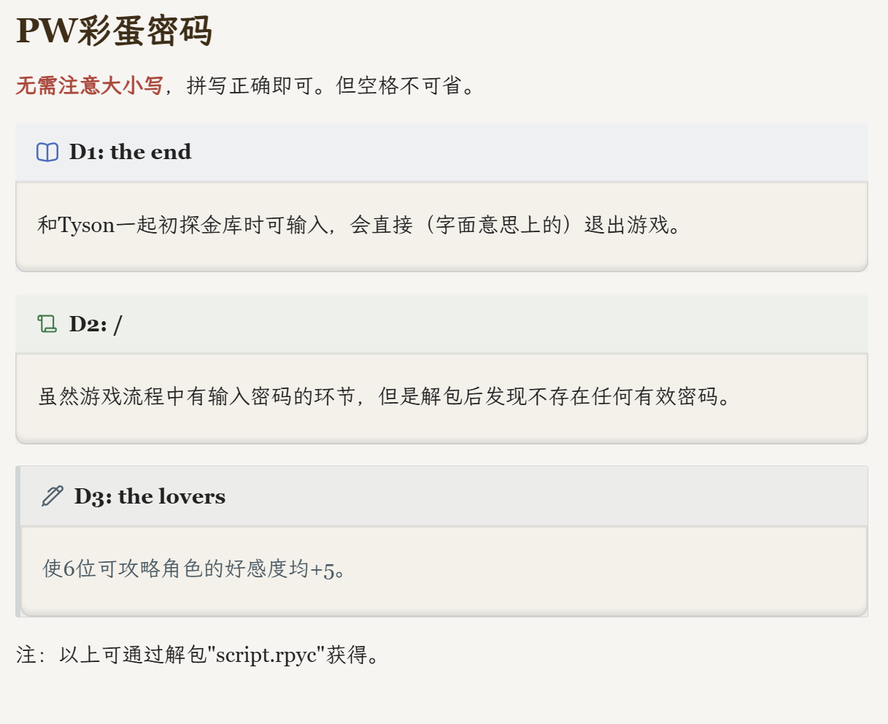

本页分为两部分：b0.85 当前仍可触发的非强制彩蛋，以及只在旧版资料或代码残留中存在的废弃设定。它们都不是普通通关或进入 Path P 的必要条件。

D7、D11 旧密码和 D8 Oswin 问答分别见[旧版本密码档案](../versions/legacy-passwords.md)与[旧版本机制档案](../versions/legacy-mechanics.md)。

## D1—D3 彩蛋密码

{fig-alt="Password b0.85 D1 至 D3 彩蛋密码及其效果"}

D1—D3 的金库输入不属于主线强制密码。现有代码中可以确认两项有效彩蛋：

| 日期 | 输入 | 效果 |
|---:|---|---|
| D1 | `THE END` | 与 Tyson 初次探索金库时输入，会直接退出游戏 |
| D2 | — | 虽然存在输入环节，但没有发现有效密码 |
| D3 | `THE LOVERS` | 六名可攻略角色的好感度各增加 5 |

### 输入规则

这些密码与其他金库密码一样：

- 不区分大小写；
- 首尾空格会被删除；
- 单词之间的空格不能省略；
- 必须在对应日期输入。

### `THE END`

D1 与 Tyson 初次探索金库时输入 `THE END`，游戏会按照字面含义直接结束当前游戏进程。它不会开启新路线，也不属于任何结局收集条件。

### `THE LOVERS`

D3 输入 `THE LOVERS` 后，以下六个主要角色好感度变量都会增加 5：

```renpy
bearlove
wolflove
boarlove
dragonlove
lionlove
croclove
```

这是目前版本游戏中幅度最大的共同好感度加点。

具体阈值见[好感度机制与加点](../mechanics/affection.md)。

## D1 奶茶杯名字彩蛋

D1 开头的公交站旁，Roswell 会让 Dave 在饮料杯上输入一个名字。该输入不仅会改变紧接着的杯面回应，部分名字还会影响后续巴士司机的身份或角色好感度。

名字分支按照代码中的具体字符串匹配。为稳定触发对应内容，建议使用下文列出的**首字母大写拼写**，首字母小写则不会正常触发。

### 最常见的输入：Dave

输入 `Dave` 会触发 Dave 使用自己名字的专属回应，并使六名主要可攻略角色的好感度各增加 1：

```text
Dean
Tyson
Roswell
Orlando
Hoss
Sal
```

### 同样容易想到的输入：六名主要角色

输入以下任一名字，会触发对应角色的专属回应，并使该角色的好感度增加 1：

```text
Dean
Tyson
Roswell
Orlando
Hoss
Sal
```

这些分支**只增加被输入角色本人的好感度**，而不是同时增加六人的好感度。

::: {.callout-important}
以下输入在正常剧情中缺少明显提示，通常需要通过脚本核验、社区交流或偶然尝试才能发现。
:::

### `Chase`

输入 `Chase` 会触发与另外一个FVN [《Echo／回音镇》](https://echoproject.itch.io/echo) 主角 Chase 有关的联动彩蛋。

Roswell 会评价这个名字听起来像一只水獭的名字（对应 Chase 的物种设定）。该输入不会改变后续司机，也不会增加角色好感度。

### `Civ`

输入 `Civ` 后，Dave 会先询问一种听起来与这个名字相似、可以用来刺人的东西。Roswell 最终猜到他指的是 `shiv` 。

```text
Dave：“用来捅人的那个东西叫什么？”
...
Roswell：“‘Civ’，嗯？我不知道这是什么意思，但听起来有点像音乐，不是吗？”
```

看到杯面上的名字后，Roswell 会评价 `Civ` 听起来很有音乐感。这是在影射参与本作配乐与声音设计的 **Civ Valian**。

该输入只有专属文字回应，不会改变司机，也不会增加角色好感度。

### `Rem`

输入 `Rem` 后，Dave 会发现杯中的饮料几乎只是水。Roswell 会慌乱地猜测，这可能是什么“含咖啡因的水”，而 Dave 无法确定自己稍微清醒了一些究竟是饮料的作用，还是单纯被吓醒了。

```text
Dave：“这……这只是水！”
Roswell：“也许他们把你的和别人的弄混了？也许他们用了……含咖啡因的水？”
```

`Rem` 同时出现在游戏鸣谢名单中，因此这一分支应属于面向支持者或相关人员的内部彩蛋。不过，剧情没有进一步解释“几乎只有水”的具体梗来源。

该输入不会改变司机，也不会增加角色好感度。

::: {.callout-note collapse="true"}
## 已确认的信息

- Civ 对应本作音乐与声音设计人员 Civ Valian；
- Rem、Timber 等名字出现在游戏鸣谢或相关公开资料中；
- Wilson、Timber 和 Zylus 均拥有独立司机立绘与专属剧情分支。
:::

::: {.callout-note collapse="true"}
## 尚未确认的对应关系

Zylus 和 Wilson 所对应的具体社区成员或支持者身份，当前没有从明确的公开来源中得到完整确认，只能推测大概率是游戏创作早期有贡献的支持者。
:::

### 隐藏司机名字

输入 `Wilson` 、`Timber` 、`Zylus` 三个名字，会影响稍后前来接送众人的巴士司机：

当游戏检查司机名字时，这三个输入都会：

- 将默认司机替换为对应的隐藏司机；
- 显示该司机的独立角色立绘；
- 使六名主要可攻略角色的好感度各增加 1。

需要注意，三者在杯面阶段的表现并不完全相同。

#### `Wilson`

输入 `Wilson` 后，Dave 会发现杯子侧面写满了密集的小字和线条，看起来像一篇论文或某种思维导图。Roswell 猜测店员可能在制作饮料时突然产生了灵感，而 Dave 表示字太小，根本看不清究竟写了什么，最后喝一口确认里面至少还是咖啡。

稍后的默认司机会被替换为狐狸 **Wilson**，并显示其专属隐藏立绘。Roswell 把司机称为古希腊神话的冥河摆渡人卡戎（Charon），Dave 也直接向“Charon”问好。司机试图纠正：“我的名字是 Wils——算了，这样也行。”
Hoss 指出他的名牌明明写着 Wilson，而 Orlando 因为“摆渡人”和“冥河过路费”的说法而紧张。Wilson 本人则表示自己根本不知道 Charon 是谁。

到达宅邸以后，Wilson 不再有专属后续，会进入普通司机告别内容。

#### `Timber`

输入 `Timber` 后，Dave 会发现杯子上画着许多围绕杯底的圆圈。他无法确定那是一堆圆，还是某种熊的图案。Roswell 则认为，看起来像是有人试图把这杯饮料做成 Hoss 会喜欢的奶茶。Dave 小心喝了一口，确认它仍然是普通咖啡。

稍后的司机会被替换为体型非常高大的熊 **Timber**，并显示其专属隐藏立绘。他的身材甚至明显超过 Dean。Timber 下车确认目的地后，态度相当简短，直接让众人上车。Orlando 对他的巨大体型非常震惊，还拐弯抹角地猜测他是不是“哪里都很大”，Sal 则反复制止 Orlando。而 Dean 承认 Timber 比自己家族中的大多数人都更高大，并略带竞争或嫉妒地暗示 Dave 有自己就已经“忙不过来”。

Timber 是三名隐藏司机中内容最多的一名。到达宅邸后，他还会单独叫住 Dave，让 Dave“照顾好自己”。Dave 感觉 Timber 仿佛已经看出了什么，并隐约知道之后将发生不好的事情。

#### `Zylus`

`Zylus` 与另外两名隐藏司机存在一个重要区别：**输入该名字时，杯面阶段没有专属文字分支。**

因此，Dave 会先看到普通的通用回应，例如无法辨认杯子上的名字，并怀疑店员是不是写错了。不过，后续司机检查仍然会识别 `Zylus`。

稍后的司机会被替换为长有鹿角和醒目长牙的 **Zylus**，并显示其专属隐藏立绘。相关对话主要围绕他的牙齿和鹿角展开：

- Dean 最初怀疑那些长牙是否属于身体改造；
- Zylus 表示长牙偶尔会造成不便，但自己总体上很喜欢；
- 刷牙和使用牙线会因此变得困难；
- 鹿角在驾驶时也可能妨碍座椅和头枕。
- Dave 因为自己的牙齿而有些自卑，看到 Zylus 后反而稍微获得了一种正常感。

到达宅邸后，Zylus 与 Wilson 一样进入普通司机告别，没有 Timber 那样的独占预警场景。

### 特殊输入汇总

::: {.easter-special-input-table .table-responsive .table-scroll-compact}

| 输入 | 杯面专属回应 | 好感度变化 | 隐藏司机 | 额外内容 |
|---|---|---|---|---|
| `Dave` | 有 | 六人各 \(+1\) | 无 | 无 |
| 六名主要角色 | 有 | 对应角色 \(+1\) | 无 | 无 |
| `Chase` | 有 | 无 | 无 | 《Echo》彩蛋 |
| `Civ` | 有 | 无 | 无 | Civ Valian 音乐制作彩蛋 |
| `Rem` | 有 | 无 | 无 | 支持者彩蛋 |
| `Wilson` | 有 | 六人各 \(+1\) | Wilson | 可能为支持者彩蛋|
| `Timber` | 有 | 六人各 \(+1\) | Timber | 支持者彩蛋 |
| `Zylus` | 无，使用通用回应 | 六人各 \(+1\) | Zylus | 支持者彩蛋 |

:::

### 其他通用输入

不具备专门分支的普通名字通常会进入通用回应。

具体剧情表现为：

- Dave 看不清杯子上写的是什么；
- 怀疑这是不是自己的杯子；
- Roswell 说店员可能和 Dave 一样没睡醒；
- 喝一口后确认配方仍然正确。

游戏不会因为某个名字属于后续登场角色，就自动为其提供彩蛋。例如，单独输入 `Oswin` 或 `Benson` 并不会触发专属回应，只会进入普通分支。

## 非当天密码的特殊回应

剧情前段，如果玩家输入一个确实存在、但并不属于当天的密码，游戏可能提示玩家“改天再来”。Dave 还会意识到，这可能表示该密码会在未来某一天生效。

剧情后期（大约D11以后）密码输入环节这样做通常只会返回普通的错误提示。

## 主界面的角色记录

游戏主界面会记录最近一次游玩的角色线，并在 Dave 身后显示相应角色。

这一变化反映的是**角色线**，不是字母线。

因此，即使同一角色线分别进入 Path A、B 或其他字母分支，主界面显示的仍然是该角色线对应角色。

但在 Path A 的 D23 Redux 部分，以及 Path A 末尾 Dave 阅读 Roswell 信件的场景中，主界面会回到不显示角色的状态。

## 蛇夫座与第十三枚奖牌

Path A 后段会提到黄道可能存在第十三个星座：蛇夫座／Ophiuchus。

但是，在当前 b0.85 中：

- Path P 只检查十二枚标准黄道奖牌；
- 代码只为十二枚奖牌建立正式收集变量；
- Compendium Lore 也只有十二项；
- 玩家无法正常取得第十三枚奖牌；
- 蛇夫座不是进入 Path P 的隐藏条件。

### 可能的早期设定关联

以下内容是根据现存剧情之间的对应关系作出的推测，未得到作者公开说明的直接确认。

#### Tyson 个人 Bad Ending

D5 中，如果 Tyson 与 Dave 争吵后独自进入森林，众人会在第二天发现 Tyson 的尸体。

该场景有两个关键细节：

- Tyson 身上存在大量抓痕；
- 手中紧握着一枚来源不明的奖牌。

剧情中的角色一度怀疑抓痕来自野兽，但没有当场说明奖牌属于哪个星座。

#### Path B 后段

Path B 中，Tyson 和 Dave 被 Dominic 与 Jack 带到 Memphis 在森林中的小屋。

两人逃出后，Tyson 会从口袋中拿出一枚奖牌，并表示自己从小屋中取得了它。

因此，早期的逻辑可能是：

```text
Tyson 独自进入森林
→ 发现 Memphis 的小屋
→ 从小屋中取得奖牌
→ 被 Dominic 和 Jack 发现并重伤
→ 最终失血过多死在森林边缘
```

旧资料据此将 Tyson 手中的未知奖牌解释为第十三枚蛇夫座奖牌。

### 为什么后来不需要收集？

Tyson 个人 Bad Ending 与正式 Path P 内容之间相隔了较长的开发时间，期间路线和世界观设定经历过多次调整。

一种可能的解释是，早期剧情曾考虑让这枚未知奖牌承担更具体的设定功能，但该设计最终没有发展为 b0.85 中可实际收集的机制。b0.85 版本 保留了部分叙事痕迹，但没有保留实际收集机制。

因此，蛇夫座目前为：

- 早期剧情设想的残留；
- Tyson 个人 Bad Ending 的隐藏背景；
- Path A 后段用于扩展世界观的叙事提示；
- **不是 b0.85 版本可收集的第十三枚奖牌。**

::: {.callout-important}
### Path P 只需要十二枚

只要十二个正式奖牌变量全部为 `True`，即可通过最终检定。

缺少蛇夫座不会阻止进入 Path P，也不存在需要通过特殊密码补收第十三枚奖牌的正常流程。
:::

## 其他旧版与隐藏内容

以下内容已在对应档案页详细整理：

- D8 Oswin 自由问答：见[旧版本机制档案](../versions/legacy-mechanics.md#d8-oswin-自由问答)；
- D11 `METEMPSYCHOSIS`：见[旧版本密码档案](../versions/legacy-passwords.md#d11-可选密码)；
- Oswin Cast File：见[Compendium 解锁索引](../collectibles/compendium.md#cast-files-代码中遗留了-oswin-的档案)；
- `CGdump`、`deanlove` 和不计入画廊的图片：见[CG 画廊查漏索引](../collectibles/gallery.md#gallery-non-gallery-index)；
- 旧 Dean 成人 CG：见[b0.85 版本主要变化](../versions/b085-changes.md#dean-线调整)。

## 相关页面

- [密码分级提示](../guide/password-hints.md)
- [好感度机制与加点](../mechanics/affection.md)
- [十二枚奖牌收集指南](../collectibles/medals.md)
- [旧版本密码档案](../versions/legacy-passwords.md)
- [旧版本机制档案](../versions/legacy-mechanics.md)
- [CG 画廊查漏索引](../collectibles/gallery.md)
