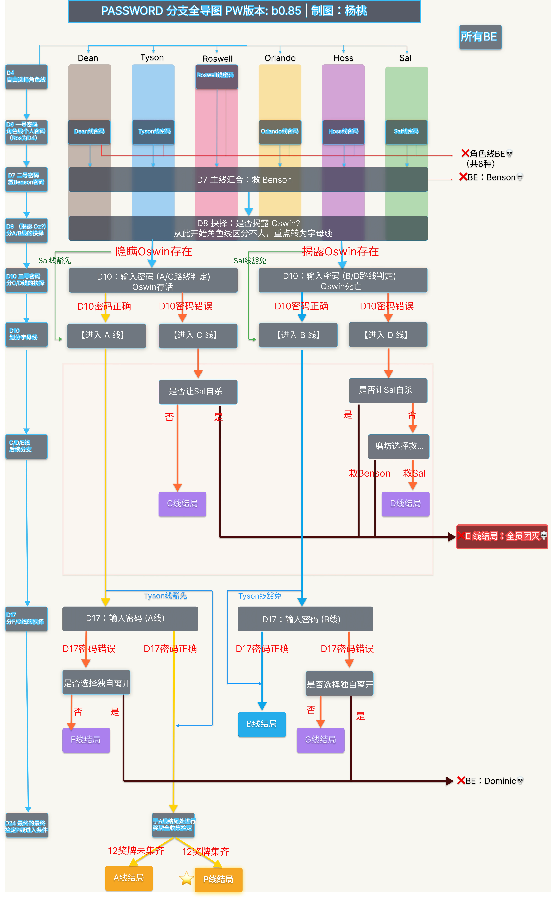

《Password》的线路并不是单纯的“攻略某个角色”，而是由**角色线**与**字母线**共同组成。

本文使用以下缩写：

- **D4、D10：** Day 4、Day 10，也就是游戏内第 4 天和第 10 天；
- **BE：** Bad Ending；
- **角色线：** Dean、Tyson、Roswell、Orlando、Hoss 或 Sal 的个人路线；
- **字母线：** Path A、B、C、D、E、F、G 与 P。

## b0.85 剧情线路逻辑图

{width=100% fig-alt="Password b0.85 的时间轴、角色线、字母线、密码检定和 Bad Ending 分支图"}

这张图基于 b0.85 制作，同时整合了时间轴和主要条件判断。为便于查阅，图中使用了以下标记：

- **蓝色实线：**剧情主干与正常通行路径；
- **橙色／红色线：**检定失败或 Bad Ending 分支；
- **金色路线：**通往 Path P 真结局的路径；
- **绿色 Sal 与蓝色 Tyson 标记：**该角色线在特定节点拥有密码检定豁免。

::: {.callout-important}
## 路线显示可能会滞后

存档界面显示的 Path 与 Dave 当时掌握的信息同步，并不一定立即反映代码层已经发生的变化。

例如，D8 选择揭露 Oswin，并在 D10 正确输入密码后，D11 的存档仍可能显示 `Path A`。实际上 Oswin 已经死亡，只是 Dave 尚不知情；直到 D11 晚上进入实验室发现尸体，路线才会在 D12 开始时显示为 `Path B`。

因此，短暂显示“错误路线”不一定代表真的走错了。
:::

## 角色线

角色线由六名可攻略角色展开：

- Dean
- Tyson
- Roswell
- Orlando
- Hoss
- Sal

玩家会在 D4 选择参加寻找奖牌比赛的搭档，由此正式确定角色线。一经选择，当前存档便不会再更改角色线。

b0.85 中，存档背景会根据角色显示不同颜色，右上角还会出现对应角色的像素头像：

| 角色 | 存档主色 |
|---|---|
| Dean | 棕色 |
| Tyson | 蓝色 |
| Roswell | 粉色 |
| Orlando | 黄色 |
| Hoss | 紫色 |
| Sal | 绿色 |

角色线的主要差异集中在 D4—D10 的日常互动、感情发展，以及 D19 附近的关系处理。进入后期后，不同角色线仍然会影响部分对话和恋爱场景，但不再主导整个事件走向。

## 字母线

字母线由关键剧情节点中的选择和密码检定决定，包括：

- Path A
- Path B
- Path C
- Path D
- Path E
- Path F
- Path G
- Path P

最早的重要分歧出现在 D8 的“是否揭露 Oswin”。此后，D10、D17 等节点的密码输入和选择会继续改变 Path。

与角色线不同，字母线可以在同一存档中继续转变，例如从 `Path A` 进入最终的 `Path P`。

## 前后期的主导结构

| 阶段 | 主导结构 |
|---|---|
| D1—D10 | 角色线差异最明显，主要影响日常互动和感情发展 |
| D11 以后 | 字母线主导主要事件，角色线主要影响局部对话和关系内容 |

## 接下来应该看什么

- 想知道 A—G、P 的进入条件： 
  [查看字母线指南](path-system.md)

- 想查看旧版本导图和已删除分支： 
  [查看旧版本线路档案](../versions/legacy-routes.md)
