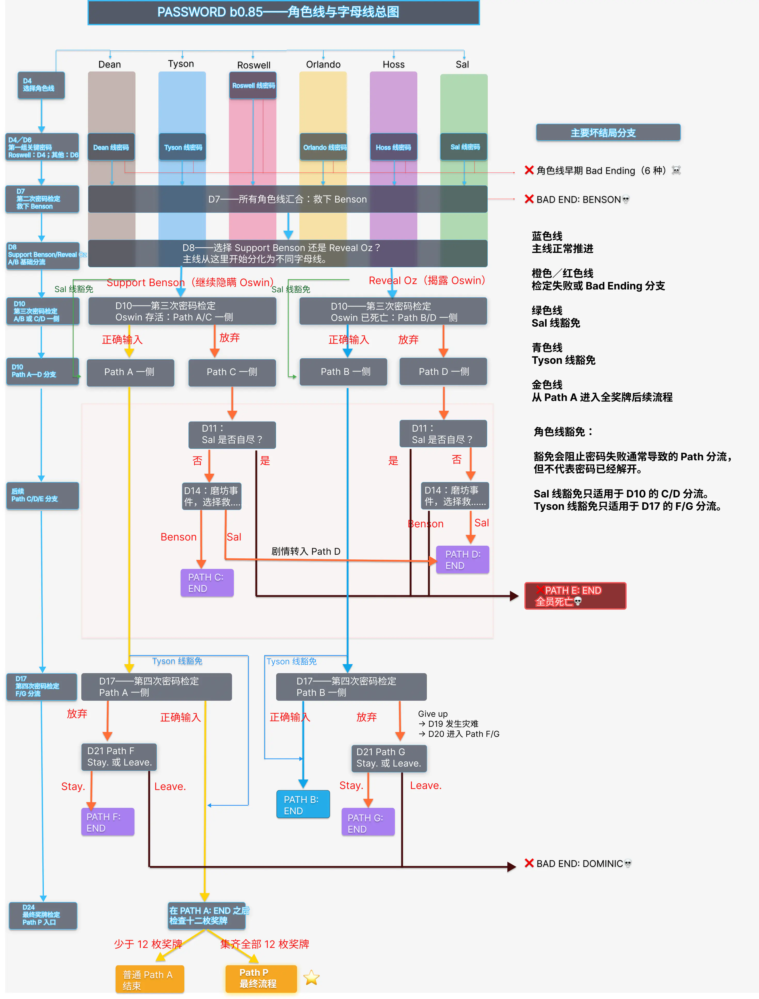

《Password》的剧情结构由两套并行系统共同组成：

- **角色线**：在 D4 选择；
- **字母线**：由后续选择、密码检定和角色生死状态共同决定。

两套系统会相互影响，但不能混为一谈。角色线决定本周目主要跟随哪名角色，并影响关系与角色专属内容；字母线则用于组织更大范围的时间线变化、主要生死结果和后期结局。

## b0.85 角色线与字母线总图

下图整合了主时间轴、角色线选择、关键密码检定、主要 Bad Ending 分支、角色线豁免和 Path A—G、Path P 的总体关系。

{width=100% fig-alt="Password b0.85 的角色线、密码检定、字母线、角色线豁免与主要 Bad Ending 分支总图"}

下文会用文字概括图中的主要结构。各个 Path 的精确进入条件见[字母线系统](path-system.md)。

## 角色线

D4 的奖牌寻找比赛开始前，Dave 会选择一名搭档。玩家先选择角色名字，再通过 **Yes.** 确认。

角色线一旦确认，在正常周目中便不会改变。之后通过 **Resonate?** 返回较早的密码节点或失败节点时，也不会重新开放 D4 搭档选择，更不会自动更换角色线。

角色线会持续影响：

- 角色专属对话；
- 私密与亲密场景；
- 好感度和关系发展；
- 约会与男友分支；
- 同一字母线中的角色专属剧情差异。

即使后期主线逐渐由字母线组织，D4 选择的角色线仍然会持续发挥作用。

## 存档中的角色线标记

Save／Load 界面的整体主题不会随角色线改变，但每个存档槽会根据当前角色线显示不同的底色，并在右上区域显示对应角色的图标。

| 角色线 | 存档槽大致颜色 |
|---|---|
| Dean 线 | 棕色 |
| Tyson 线 | 浅蓝色 |
| Roswell 线 | 粉色或洋红色 |
| Orlando 线 | 黄色 |
| Hoss 线 | 紫色 |
| Sal 线 | 亮绿色 |

图标和底色表示该存档在 D4 选择的角色线，不代表当前字母线、好感度最高的角色，也不代表是否已经进入男友关系。

## 字母线

字母线系统由 Path A—G 和 Path P 组成。

第一个主要分歧出现在 D8：玩家需要选择 **Support Benson** 或 **Reveal Oz**。之后，D10、D17 的密码检定以及后续角色生死状态会继续改变当前流程。

与角色线不同，字母线可以在同一周目中发生变化。例如：

- 流程可能从 Path A 的方向继续进入最终的 Path P；
- 从 Path C 一侧开始的流程，也可能在 D14 的生死结果后被改判为 Path D。

因此，字母线更接近对当前时间线状态和后期主线结果的分类，而不是一次选择后永久固定的个人路线。

具体分流条件、Path E 的多入口结构，以及 Sal／Tyson 线的特殊豁免见[字母线系统](path-system.md)。

## 为什么存档显示的 Path 可能滞后

存档槽显示的是脚本在当前剧情节点已经赋予的 Path，而不会提前透露 Dave 尚未得知的事件结果。

例如：

1. D8 选择 **Reveal Oz** 后，剧情状态已经开始向 Oswin 早死的一侧发展；
2. D10 正确完成密码检定时，脚本仍会先把当前 Path 设为 A；
3. D11 中，在 Dave 发现 Oswin 的尸体之前保存，存档仍可能显示 `Path A`；
4. D11 晚上发现尸体后，游戏会立即把当前 Path 改为 B；
5. 此后保存的存档已经会显示 `Path B`，D12 的日切画面只是下一次明确显示 B 的新日界面。

因此，短暂出现看似不符合预期的 Path 标签，并不一定表示玩家走错了路线。剧情结果可能已经由隐藏状态决定，只是当前显示仍在等待 Dave 获得相应信息。

::: {.callout-note}
## Sal 线的显示异常

Sal 线在 D10 放弃密码检定后，存档槽可能暂时显示 `Path C`，但剧情实际上仍会进入共同的 Path A/B 流程。

这是 b0.85 及更早版本中存在的 Path 状态显示不一致，不代表流程真正进入了通常的 Path C 剧情。具体机制见[字母线系统](path-system.md)。
:::

## 两套系统如何分工

随着剧情推进，字母线会越来越多地决定主要生死结果和时间线方向；角色线则继续决定角色视角、关系发展和字母线内部的专属剧情内容。

::: {.route-system-table .table-responsive}

| 系统 | 主要作用 |
|---|---|
| 角色线 | 搭档视角、角色专属场景、好感度、恋爱和关系结局 |
| 字母线 | 主要时间线方向、角色生死结果、后期剧情结构和结局分类 |

:::

因此：

- 两名玩家可能处于同一个 Path，却因为选择了不同角色线而看到不同场景；
- 同一角色线的两个周目，也可能因为密码检定和关键选择不同而进入不同 Path。

## 相关内容

- [字母线系统](path-system.md)
- [密码分级提示](password-hints.md)
- [旧版本线路档案](../versions/legacy-routes.md)
