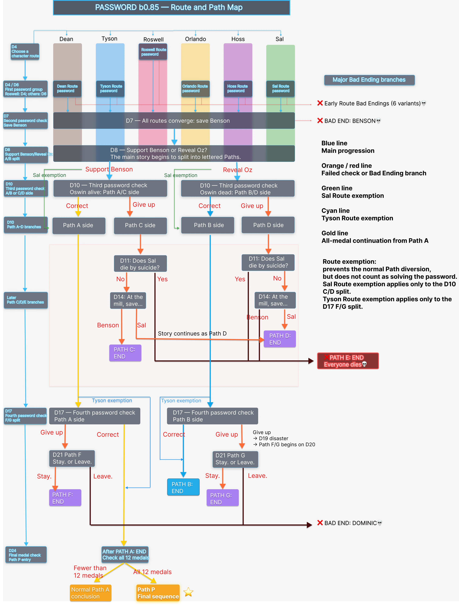

The story structure in *Password* combines two parallel systems:

- a **character Route**, chosen on D4;
- a **lettered Path**, shaped by later choices, password checks, and survival outcomes.

Your character Route determines whose story and relationship you follow. The lettered Path determines how the main story develops, who survives, and which ending you reach.

## b0.85 route map

The diagram below combines the main timeline, character-route selection, key password checks, bad-ending branches, and the lettered Path structure.

{width=100% fig-alt="Password b0.85 timeline showing character routes, password checks, lettered Paths, route exceptions, and major bad-ending branches"}

For the exact requirements of each lettered Path, see [Lettered Path System](path-system.md).

## Character routes

On D4, Dave chooses a partner for the medal-search competition. The player first selects a character name, then confirms the choice with **Yes.**

Once confirmed, the selected character route remains fixed for the normal playthrough. Later **Resonate?** jumps can return the player to an earlier password check or failure scene, but they do not reopen the D4 partner selection or change the route.

Character routes continue to affect:

- character-specific dialogue;
- private and intimate scenes;
- affection and relationship development;
- dating and boyfriend branches;
- route-specific variations within later Path scenes.

They remain relevant throughout the game, even after the lettered Paths begin to organize the larger story structure.

## Save-slot route indicators

Each save slot uses the selected character Route’s color and displays that character’s portrait in the upper-right corner.

| Character route | Approximate save-slot tint |
|---|---|
| Dean Route | brown |
| Tyson Route | light blue |
| Roswell Route | pink or magenta |
| Orlando Route | yellow |
| Hoss Route | purple |
| Sal Route | bright green |

The portrait and color correspond to the character you chose on D4.

## Lettered Paths

The lettered system consists of Path A–G and Path P.

The first major split occurs on D8, when the player chooses **Support Benson** or **Reveal Oz**. Password checks and later survival outcomes continue to shape the story on D10, D17, and subsequent days.

Unlike the character route, the current Path can change during the same playthrough. For example, a run can begin on the Path A side and later continue into Path P after the final medal check.

Path changes are not limited to the final Path P transition. A run that begins on the Path C side can also end up on Path D after the D14 survival outcomes.

For the full Path requirements and route-specific exceptions, see [Lettered Path System](path-system.md).

## Why the save-slot Path can update late

Save slots do not reveal an outcome before Dave learns what happened, so the displayed Path may temporarily lag behind the story's actual direction.

For example:

1. Choosing **Reveal Oz** on D8 already locks in Oswin's early death.
2. Passing the D10 password check still sets the current Path to A at that point.
3. During D11, saves made before Dave discovers Oswin's body can still display `Path A`.
4. When the body is discovered on D11 night, the game changes the current Path to B immediately.
5. Saves made after that scene already display `Path B`; the D12 day-transition screen is simply the next new-day display to show B.

::: {.callout-note}
## Sal Route display quirk

After giving up on the D10 password during the Sal Route, the save slot may temporarily display `Path C`. This is a display quirk in b0.85 and earlier versions; the story still follows the shared Path A/B sequence. For the exact mechanics, see [Lettered Path System](path-system.md).
:::

## How the two systems divide the story

The lettered Paths increasingly organize the major survival and timeline outcomes, while the selected character route continues to shape dialogue, intimate scenes, and relationship outcomes within those Path branches.

::: {.route-system-table .table-responsive}

| System | Main function |
|---|---|
| Character route | Companion perspective, character scenes, affection, romance, and relationship outcomes |
| Lettered Path | Major timeline direction, survival outcomes, later-story structure, and ending outcomes |

:::

Two players can share the same lettered Path while seeing different character-route scenes, and two runs on the same character route can still diverge into different lettered Paths.

## Related guides

- [Lettered Path System](path-system.md)
- [Tiered Password Hints](password-hints.md)
