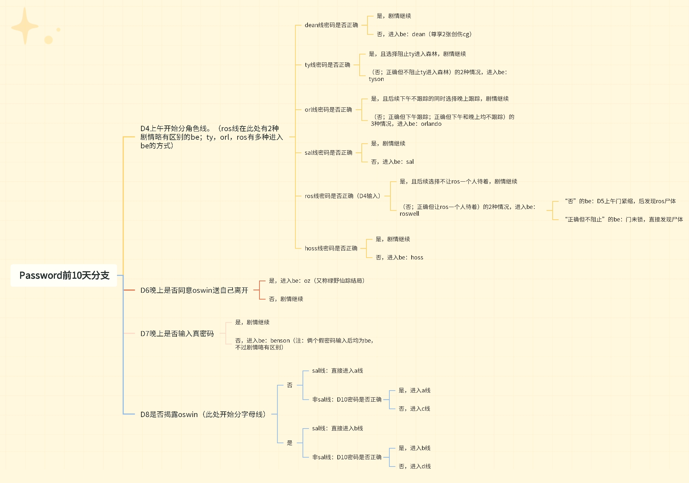
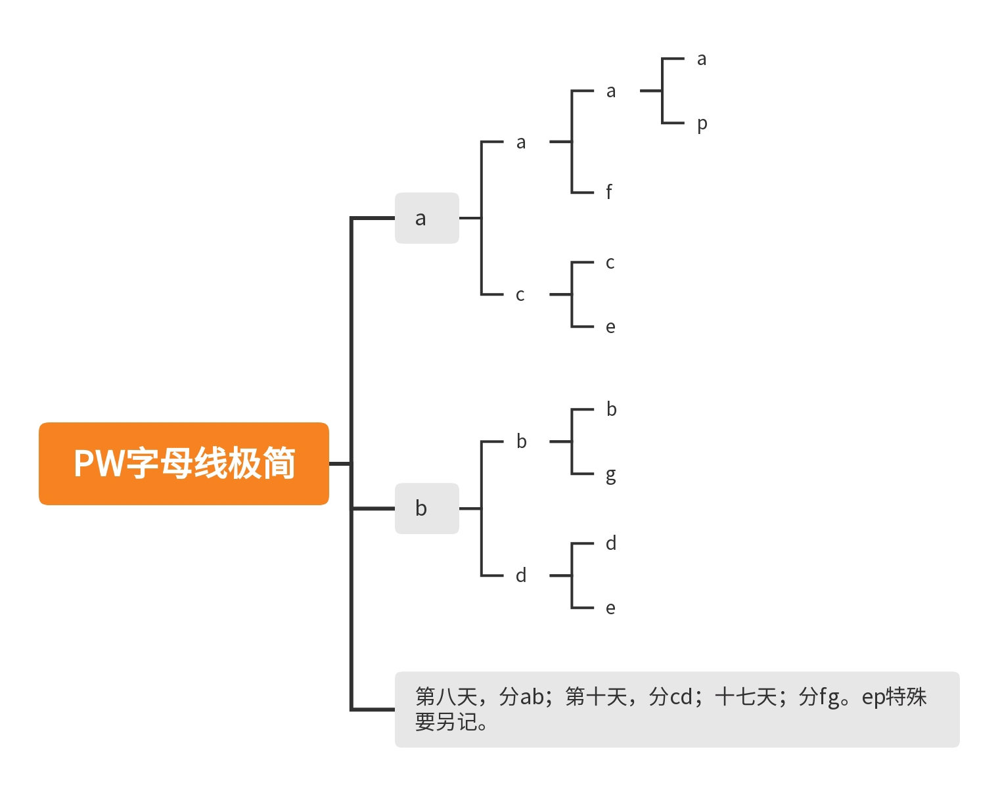
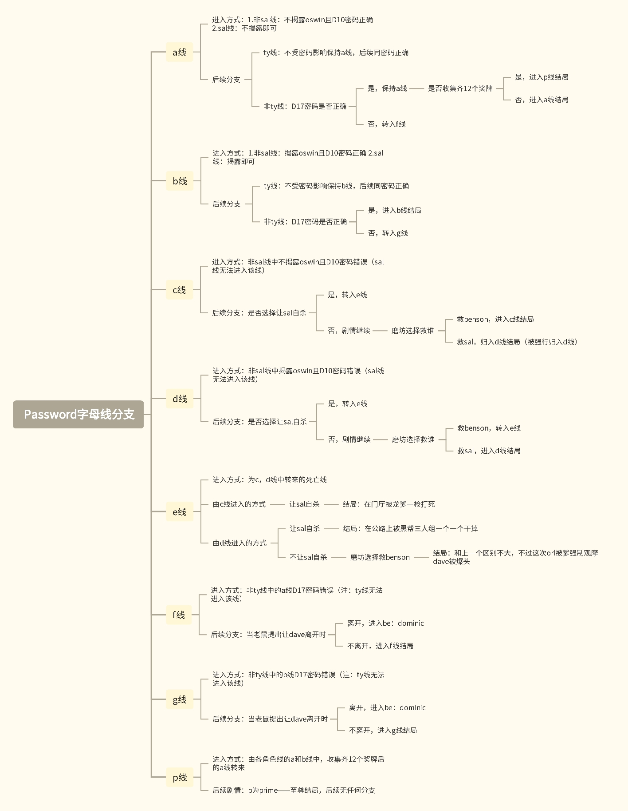

本页保存 2023 年整理并发布于 B 站的三张《Password》旧版本路线图。

这些导图记录了当时的角色线、密码、Bad Ending 和字母线结构，能够用于理解攻略内容的历史变化，但**不能直接作为 b0.85 的当前通关路线图**。

::: {.callout-warning}
## 版本警告

旧图中包含已经被 b0.85 删除或简化的流程，例如：

- Orlando 线 D6 的第二次跟踪选择；
- Roswell 线的多次救援判断；
- D6 晚上是否离开宅邸；
- D7 的两个假密码；
- 部分旧版结局描述。

当前路线请查看：

- [剧情线路总览](../guide/route-overview.md)
- [字母线系统](../guide/path-system.md)
:::

## 导图概览

| 导图 | 主要内容 | 适合用途 |
|---|---|---|
| 前十天分支 | D4 角色线、前期密码和 D8—D10 分流 | 理解旧版前期流程 |
| 字母线极简 | 用最少节点表示 A—G、P 的演变关系 | 快速理解字母线的层级 |
| 字母线分支 | 各字母线的详细进入方式和结局分流 | 查看旧版完整路线逻辑 |

三张图均为攻略整理图，非游戏作者发布的官方流程图。

## 前十天分支

{fig-alt="Password 旧版本 D1 至 D10 角色线、密码和字母线分支图"}

这张图以 D4—D10 为核心，记录了旧版前期三个层次的分支。

图中包含旧版 D6 离开宅邸、D7 假密码及更复杂的角色线条件；这些节点在 b0.85 中已经删除或简化。当前流程以[剧情线路总览](../guide/route-overview.md)和[字母线系统](../guide/path-system.md)为准。

## 字母线极简图

{.path-diagram-simple fig-alt="Password 字母线 A、B、C、D、E、F、G、P 的极简树状结构"}

这张图只保留 A—G 与 P 的层级关系，适合快速理解线路之间的演变，但不能单独作为通关攻略。

## 字母线详细分支图

{.path-diagram-detailed fig-alt="Password 旧版本 Path A 至 G 和 Path P 的进入条件及结局分支图"}

这张图记录了旧版各线的进入条件和结局分流。部分主干关系在 b0.85 中仍然存在，但具体条件应以当前[字母线系统](../guide/path-system.md)为准。

## b0.85 已确认的路线变化

| 旧版流程 | b0.85 |
|---|---|
| Orlando 线需要处理下午和晚上的两次跟踪选择 | 只保留下午的主要选择 |
| Roswell 线存在多次救援判断 | 简化为一次主要救援选择 |
| D6 晚上可以选择离开宅邸 | 选项和对应 Bad Ending 删除 |
| D7 存在两个假密码 | 假密码剧情删除 |
| D8 存在 Oswin 自由问答 | 整个问答环节删除 |
| D11 存在可选金库密码 | 正常入口删除 |
| Path A 特殊剧情只能在正常流程中出现一次 | 可在 Additional Scenes 中回放 |
| Path P 采用旧版事件和文本 | 多处剧情与文本经过调整 |

详细版本说明见[b0.85 版本主要变化](b085-changes.md)。

## 当前版替代资料

| 查询目标 | 当前页面 |
|---|---|
| b0.85 整体时间轴 | [剧情线路总览](../guide/route-overview.md) |
| A—G 与 P 的进入条件 | [字母线系统](../guide/path-system.md) |
| 当前密码提示 | [密码分级提示](../guide/password-hints.md) |
| 十二枚奖牌与 Path P | [十二枚奖牌收集指南](../collectibles/medals.md) |
| 旧密码 | [旧版本密码档案](legacy-passwords.md) |
| 旧机制和代码残留 | [旧版本机制档案](legacy-mechanics.md) |
